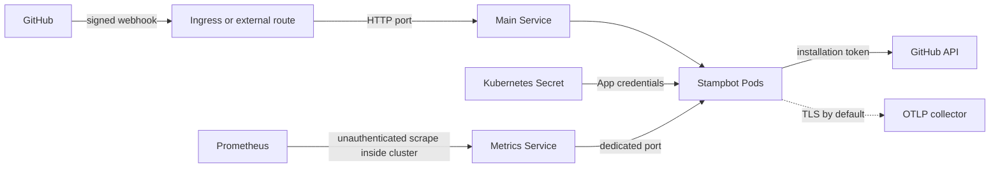

# Stampbot Helm chart

This chart deploys [Stampbot](../../README.md) as a GitHub App on Kubernetes.
It is for operators who already have a cluster and either own a GitHub App or
plan to create one through Stampbot's guarded setup flow.

The chart is published as an OCI artifact at
`oci://ghcr.io/dannysauer/charts/stampbot`. Use a fixed chart version for every
install and upgrade.

## What the chart deploys

The main Service carries webhook and health traffic. Metrics use a second,
cluster-internal Service when you enable them.



In plain text, GitHub sends a signed request through your route and the main
Service to a Stampbot Pod. The Pod reads App credentials from one Secret and
calls the GitHub API. Prometheus and an OpenTelemetry Protocol (OTLP) collector
use separate paths that you must admit deliberately.

The chart always creates a Deployment, ConfigMap, and main Service. It packages
two test hooks for `helm test`. A ServiceAccount, Horizontal Pod Autoscaler
(HPA), and PodDisruptionBudget are on by default. Other resources depend on
the values described below.

The chart does not create a GitHub App, domain name, TLS certificate, ingress
controller, monitoring stack, or secret-store controller.

## Before you install

Work from a shell with access to the target cluster. The commands on this page
use Bash and assume the repository root only when they refer to local files.

You need:

- Helm. The repository pins Helm 4.2.3 in [`.tool-versions`](../../.tool-versions).
- `kubectl` access to the target namespace.
- Permission to create and manage the resources enabled in your values.
- A public HTTPS route that GitHub can reach at `/webhook`.
- A GitHub App ID, PEM private key, and webhook secret, unless you use the
  first-run setup flow.

The chart does not declare a `kubeVersion` range. It renders stable
`apps/v1`, `autoscaling/v2`, `networking.k8s.io/v1`, and `policy/v1`
resources. Validate the rendered manifests against every Kubernetes version
you operate.

Check the core permissions in the target namespace before installation:

```bash
NAMESPACE=stampbot

for resource in \
  deployments.apps \
  horizontalpodautoscalers.autoscaling \
  poddisruptionbudgets.policy \
  services \
  serviceaccounts \
  configmaps \
  secrets \
  pods
do
  kubectl auth can-i create "${resource}" --namespace "${NAMESPACE}"
done
```

Each command must print `yes`. Check optional custom resources separately when
you enable them.

### Optional cluster dependencies

Optional resources depend on cluster components for useful behavior. Custom
resources also need their custom resource definitions (CRDs) before Helm can
install them. This table marks each boundary.

| Feature | Value | Cluster dependency | What the chart does not do |
| --- | --- | --- | --- |
| Ingress | `ingress.enabled` | An ingress controller for `ingress.className` | Create DNS records or TLS Secrets |
| CPU autoscaling | `autoscaling.enabled` | Metrics Server for live CPU decisions | Install a metrics API |
| Custom autoscaling | `autoscaling.customMetrics.enabled` | A custom-metrics adapter and matching metric rules | Configure the adapter |
| Vertical scaling | `vpa.enabled` | Vertical Pod Autoscaler CRD and controller | Coordinate VPA with the HPA |
| Prometheus discovery | `metrics.serviceMonitor.enabled` | Prometheus Operator ServiceMonitor CRD and controller | Install Prometheus or the operator |
| External credentials | `externalSecrets.enabled` | External Secrets Operator and a SecretStore | Create the SecretStore or remote secret |
| Network isolation | `networkPolicy.enabled` | A network plugin that enforces NetworkPolicy | Adapt selectors to your cluster |
| Grafana dashboard | `grafanaDashboard.enabled` | A Grafana sidecar or another ConfigMap loader | Install Grafana |

Helm does not install or upgrade these CRDs.

### Match the ingress body limit to Stampbot's

Stampbot rejects a webhook body over 1 MiB with a `413` and counts it in
`stampbot_errors_total{error_type="payload_too_large"}`. GitHub can send a
payload of up to 25 MB, and it doesn't retry a failed delivery on its own; the
attempt stays in the App's **Recent Deliveries** page, where you can inspect it
and redeliver it by hand. The ingress controller in front of Stampbot should
enforce the same 1 MiB, for two different reasons.

A smaller controller limit drops deliveries Stampbot would have accepted, and
Stampbot's own logs and metrics never see them. A larger one is worse. Stampbot
checks `Content-Length` before reading, but a chunked request carries no
`Content-Length`, and Stampbot reads the whole body into memory before it can
measure and reject it. With the controller allowing 25 MiB, about twenty
concurrent oversized requests from an unauthenticated client fill the chart's
default 512 MiB memory limit. Enforcing the limit while reading is tracked in
[#323](https://github.com/dannysauer/stampbot/issues/323); until that lands,
the controller is the layer that protects the pod, and its limit must be finite
and no larger than Stampbot's.

The event types Stampbot subscribes to stay small. Over one week across three
organizations, on a GitHub App receiving the same events, the largest
`pull_request` delivery was 149 KiB, the largest `issue_comment` 513 KiB, and
the largest `pull_request_review_comment` 61 KiB. Pushes are larger: of 19,649
pushes over 30 days, 151 (0.8%) were between 512 KiB and 1 MiB, and the ingress
in front of that App rejected about eight deliveries a day for exceeding 1 MiB,
event type unknown. Because the type is unknown, that sample can't show whether
any of the rejected deliveries were events Stampbot handles. Stampbot doesn't
subscribe to pushes today.

For ingress-nginx, `1m` is the default, so nothing needs adding unless a
cluster-wide `proxy-body-size` has raised it. Setting it on the Ingress through
`ingress.annotations` pins it:

```yaml
ingress:
  annotations:
    nginx.ingress.kubernetes.io/proxy-body-size: 1m
```

Traefik streams bodies by default, so add a `buffering` middleware to the route
with `maxRequestBodyBytes: 1048576`. Istio also streams by default; an
`EnvoyFilter` that inserts the `buffer` HTTP filter with `max_request_bytes:
1048576` on the route enforces it. Contour's HTTPProxy has no body-size setting,
so put a proxy or WAF that enforces one in front of it, or don't expose the
webhook through Contour until #323 lands. Cloud Run enforces its own 32 MiB
request limit, which is finite but well above Stampbot's; see the
[Cloud Run guide](../../docs/deploy-gcp-cloudrun.md) and treat #323 as the fix
for that gap too.

The limit itself is documented in the [reference](../../docs/reference.md) and
the [security requirements](../../docs/security-requirements.md); this section
is about keeping the controller in step with it.

## Install from the OCI registry

### Create the namespace and credential Secret

If the namespace already exists, the first command updates no resources beyond
its metadata. The Secret command fails without changing an existing Secret.

```bash
NAMESPACE=stampbot
SECRET_NAME=stampbot-github

kubectl create namespace "${NAMESPACE}" \
  --dry-run=client \
  --output=yaml \
  | kubectl apply --filename=-

read -r -p "Path to the GitHub App private key: " PRIVATE_KEY_FILE
test -r "${PRIVATE_KEY_FILE}"
read -r -p "GitHub App ID: " STAMPBOT_APP_ID
read -r -s -p "GitHub webhook secret: " STAMPBOT_WEBHOOK_SECRET
printf '\n'

credential_dir="$(mktemp -d)"
cleanup_credentials() {
  rm -f \
    "${credential_dir}/app-id" \
    "${credential_dir}/webhook-secret"
  rmdir "${credential_dir}"
  unset STAMPBOT_APP_ID STAMPBOT_WEBHOOK_SECRET
}
trap cleanup_credentials EXIT

umask 077
printf '%s' "${STAMPBOT_APP_ID}" > "${credential_dir}/app-id"
printf '%s' "${STAMPBOT_WEBHOOK_SECRET}" > "${credential_dir}/webhook-secret"

kubectl create secret generic "${SECRET_NAME}" \
  --namespace "${NAMESPACE}" \
  --from-file=STAMPBOT_APP_ID="${credential_dir}/app-id" \
  --from-file=STAMPBOT_PRIVATE_KEY="${PRIVATE_KEY_FILE}" \
  --from-file=STAMPBOT_WEBHOOK_SECRET="${credential_dir}/webhook-secret"

cleanup_credentials
trap - EXIT
```

The Secret must contain those exact three keys. The private key and webhook
secret stay out of the Helm values and release record.

### Create the release values

Save the next example as `stampbot-values.yaml`. Replace the reserved
`example.com` host and TLS Secret name with the route you operate. The TLS
Secret must exist before the Ingress can serve HTTPS.

```yaml
github:
  existingSecret: stampbot-github

setup:
  enabled: false
  allowConfigured: false

ingress:
  enabled: true
  className: nginx
  hosts:
    - host: stampbot.example.com
      paths:
        - path: /
          pathType: Prefix
  tls:
    - secretName: stampbot-tls
      hosts:
        - stampbot.example.com
```

Use a private configuration repository or another managed store for this file.
Do not put credentials in it.

### Inspect and install the chart

Choose a chart release you have verified. The prompt avoids baking a version
that will drift out of this page.

```bash
NAMESPACE=stampbot
read -r -p "Chart version to install: " CHART_VERSION
test -n "${CHART_VERSION}"

helm show chart oci://ghcr.io/dannysauer/charts/stampbot \
  --version "${CHART_VERSION}"
helm show values oci://ghcr.io/dannysauer/charts/stampbot \
  --version "${CHART_VERSION}"

helm install stampbot oci://ghcr.io/dannysauer/charts/stampbot \
  --version "${CHART_VERSION}" \
  --namespace "${NAMESPACE}" \
  --values stampbot-values.yaml \
  --wait \
  --timeout 5m
```

Verify the chart package and its release provenance before promoting it. The
[release verification guide](../../docs/release-verification.md) gives the
commands.

### Install from a source checkout

The checked-in `Chart.yaml` uses placeholder chart and application versions.
Set an image tag or digest when you install from source. Without that override,
Kubernetes tries to pull the placeholder tag.

```bash
NAMESPACE=stampbot
read -r -p "Published Stampbot image tag: " APP_VERSION
test -n "${APP_VERSION}"

helm install stampbot ./charts/stampbot \
  --namespace "${NAMESPACE}" \
  --values stampbot-values.yaml \
  --set-string image.tag="${APP_VERSION}" \
  --wait \
  --timeout 5m
```

For a controlled deployment, prefer `image.digest` after verifying the image.
The digest takes precedence over `image.tag`.

## Verify the release

Check Helm and the Kubernetes rollout first:

```bash
NAMESPACE=stampbot

helm status stampbot --namespace "${NAMESPACE}"
kubectl rollout status deployment/stampbot \
  --namespace "${NAMESPACE}" \
  --timeout=5m
kubectl get pods,services,ingresses \
  --namespace "${NAMESPACE}"
```

Run a local port-forward in one shell:

```bash
kubectl port-forward service/stampbot 8000:80 --namespace stampbot
```

Query the probes from another shell:

```bash
curl --fail --silent --show-error http://127.0.0.1:8000/health
curl --fail --silent --show-error http://127.0.0.1:8000/ready
```

`/health` returns a shallow liveness result. `/ready` returns HTTP 200 when
credentials are present or when the guarded setup flow is available. An
unconfigured release with setup disabled returns HTTP 503 from `/ready`.

Run the chart test hooks:

```bash
helm test stampbot --namespace stampbot --logs --timeout 2m
```

`test-connection` checks `/health`, `/ready`, and `/` through the main
Service. It also checks `/metrics` through the metrics Service when metrics
are enabled. `test-webhook` sends a valid signed `ping` and then a tampered
signature. It skips that signature test when the App is not configured.

These hooks prove in-cluster behavior. They do not prove public DNS, TLS, the
GitHub webhook setting, controller reconciliation, or NetworkPolicy
enforcement.

## Use the first-run setup flow

Use setup mode only when you need Stampbot to create a GitHub App. The setup
page is a provisioning surface. Restrict access upstream and keep the window
short.

Create an existing Secret with empty keys so Helm does not store the
credentials returned by GitHub:

```bash
kubectl create secret generic stampbot-github \
  --namespace stampbot \
  --from-literal=STAMPBOT_APP_ID= \
  --from-literal=STAMPBOT_PRIVATE_KEY= \
  --from-literal=STAMPBOT_WEBHOOK_SECRET=
```

Enable setup with the trusted public URL:

```yaml
github:
  existingSecret: stampbot-github

setup:
  enabled: true
  allowConfigured: false
  baseUrl: https://stampbot.example.com
```

`setup.baseUrl` must use HTTPS unless its host is loopback. It may include a
reverse-proxy path. It must not contain credentials, a query, a fragment, unsafe
characters, or an invalid port. Stampbot never builds this URL from `Host` or
forwarding headers.

Install the release, visit `/setup`, and complete GitHub's App manifest flow.
The callback displays the App ID, private key, and webhook secret once. Use the
[credential rotation procedure](#rotate-credentials) to store them in the
existing Secret. That procedure restarts the Pods because environment
variables do not update in a running process.

After the credentials are present, Stampbot closes all setup routes even if
`setup.enabled` remains true. Set it to false in your values and upgrade the
release anyway. That makes the intended state explicit.

`setup.allowConfigured=true` reopens setup on a configured instance. The
schema requires `setup.enabled=true` at the same time. Treat this pair as a
short-lived recovery switch, then turn both values off.

The [installation guide](../../INSTALLATION.md#create-the-github-app) covers
the GitHub App permissions and repository installation.

## Choose a credential mode

The Deployment reads all credentials from one Secret. These are the required
keys:

| Secret key | Content |
| --- | --- |
| `STAMPBOT_APP_ID` | GitHub App ID |
| `STAMPBOT_PRIVATE_KEY` | PEM private key |
| `STAMPBOT_WEBHOOK_SECRET` | HMAC secret configured on the GitHub webhook |

Choose one mode. If `github.existingSecret` and
`externalSecrets.enabled` are both set, the Deployment uses the existing
Secret while the chart still creates an unused ExternalSecret.

| Mode | Values | Owner | Security boundary |
| --- | --- | --- | --- |
| Existing Secret | `github.existingSecret` | You or another controller | Helm stores only the Secret name |
| External Secrets Operator | `externalSecrets.enabled=true` | External Secrets Operator | Helm stores remote references, not credential values |
| Inline values | `github.appId`, `github.privateKey`, `github.webhookSecret` | Helm release | Credentials enter rendered manifests and Helm release storage |

Prefer an existing Secret or External Secrets Operator. Do not pass inline
credentials through `--set`, CI arguments, or a committed values file.

### Use External Secrets Operator

Create the `SecretStore` or `ClusterSecretStore` before you install. The chart
creates only the ExternalSecret and its target Secret.

```yaml
externalSecrets:
  enabled: true
  secretStore:
    name: aws-secrets-manager
    kind: SecretStore
  refreshInterval: 1h
  data:
    - secretKey: STAMPBOT_APP_ID
      remoteRef:
        key: stampbot/github-credentials
        property: app_id
    - secretKey: STAMPBOT_PRIVATE_KEY
      remoteRef:
        key: stampbot/github-credentials
        property: private_key
    - secretKey: STAMPBOT_WEBHOOK_SECRET
      remoteRef:
        key: stampbot/github-credentials
        property: webhook_secret
```

All three target keys are required. For a release named `stampbot`, the target
Secret is `stampbot-external`.

Wait for the controller before expecting the Deployment to become ready:

```bash
kubectl get externalsecret stampbot-external --namespace stampbot
kubectl wait \
  --for=condition=Ready \
  externalsecret/stampbot-external \
  --namespace stampbot \
  --timeout=2m
kubectl get secret stampbot-external --namespace stampbot
```

### Add an IRSA annotation on Amazon EKS

`awsSecretsManager.enabled` adds an IAM Roles for Service Accounts (IRSA)
annotation to a ServiceAccount created by this chart. It does not configure the
AWS region, remote key, SecretStore, or External Secrets authentication.

Use one owner for the ServiceAccount. If Helm creates it, set the role:

```yaml
serviceAccount:
  create: true

awsSecretsManager:
  enabled: true
  roleArn: arn:aws:iam::000000000000:role/example-stampbot-secrets
```

The all-zero account is a reserved example. Replace the entire ARN in private
deployment configuration.

If another system creates the ServiceAccount, disable chart ownership:

```yaml
serviceAccount:
  create: false
  name: stampbot

awsSecretsManager:
  enabled: false
```

The chart leaves `serviceAccount.automountServiceAccountToken=false` in both
credential patterns. External Secrets Operator can request an identity token
for a referenced ServiceAccount without mounting a general Kubernetes API
token in the Stampbot Pod.

`awsSecretsManager.secretName` and `awsSecretsManager.region` are reserved.
The templates do not read them. Configure the remote key in
`externalSecrets.data` and the region in your SecretStore.

### Rotate credentials

Update the Secret through its owning system. If you own an existing Secret,
recreate its manifest with the same three keys and apply it without printing
decoded values:

```bash
set -o pipefail
NAMESPACE=stampbot
SECRET_NAME=stampbot-github

read -r -p "Path to the GitHub App private key: " PRIVATE_KEY_FILE
test -r "${PRIVATE_KEY_FILE}"
read -r -p "GitHub App ID: " STAMPBOT_APP_ID
read -r -s -p "GitHub webhook secret: " STAMPBOT_WEBHOOK_SECRET
printf '\n'

credential_dir="$(mktemp -d)"
cleanup_credentials() {
  rm -f \
    "${credential_dir}/app-id" \
    "${credential_dir}/webhook-secret"
  rmdir "${credential_dir}"
  unset STAMPBOT_APP_ID STAMPBOT_WEBHOOK_SECRET
}
trap cleanup_credentials EXIT

umask 077
printf '%s' "${STAMPBOT_APP_ID}" > "${credential_dir}/app-id"
printf '%s' "${STAMPBOT_WEBHOOK_SECRET}" > "${credential_dir}/webhook-secret"

kubectl create secret generic "${SECRET_NAME}" \
  --namespace "${NAMESPACE}" \
  --from-file=STAMPBOT_APP_ID="${credential_dir}/app-id" \
  --from-file=STAMPBOT_PRIVATE_KEY="${PRIVATE_KEY_FILE}" \
  --from-file=STAMPBOT_WEBHOOK_SECRET="${credential_dir}/webhook-secret" \
  --dry-run=client \
  --output=yaml \
  | kubectl apply --server-side --filename=-

cleanup_credentials
trap - EXIT
```

Restart the Deployment:

```bash
kubectl rollout restart deployment/stampbot --namespace stampbot
kubectl rollout status deployment/stampbot \
  --namespace stampbot \
  --timeout=5m
helm test stampbot --namespace stampbot --logs --timeout 2m
```

Revoke the old GitHub private key or webhook secret after the new Pods pass the
signed webhook test.

## Enable Prometheus metrics

Metrics are off by default. When enabled, Stampbot binds an unauthenticated
Prometheus listener to `0.0.0.0` inside the Pod. The chart creates a dedicated
ClusterIP Service and never adds the metrics port to the main Service or
Ingress.

ClusterIP is not authorization. Limit network access to trusted monitoring
clients.

Enable the listener and, when available, Prometheus Operator discovery:

```yaml
metrics:
  enabled: true
  port: 9090
  serviceMonitor:
    enabled: true
    interval: 30s
    scrapeTimeout: 10s
```

`metrics.serviceMonitor.enabled` has no effect unless `metrics.enabled` is
also true. Install the ServiceMonitor CRD before Helm renders that object.

Verify the separate path:

```bash
kubectl get service stampbot-metrics --namespace stampbot
kubectl get servicemonitor stampbot --namespace stampbot
kubectl port-forward service/stampbot-metrics 9090:9090 --namespace stampbot
```

From another shell:

```bash
curl --fail --silent --show-error http://127.0.0.1:9090/metrics
```

The supplied NetworkPolicy uses the named `metrics` container port. A custom
`metrics.port` keeps the same policy rule.

To remove metrics, set `metrics.enabled=false` and upgrade. The rollout stops
the listener and removes the metrics Service and chart-managed ServiceMonitor.
Plan for a monitoring gap before that change.

## Export traces over TLS

Stampbot uses TLS for OTLP gRPC export unless you opt in to plaintext. Enable
tracing with an HTTPS collector endpoint:

```yaml
config:
  otelEnabled: true
  otelEndpoint: https://otel-collector:4317
  otelServiceName: stampbot
  otelInsecure: false
```

If `otelEnabled` is true and the endpoint is empty, Stampbot logs a warning and
does not create an exporter.

For a private certificate authority, create a Secret from the CA certificate:

```bash
read -r -p "Path to the collector CA certificate: " OTEL_CA_FILE
test -r "${OTEL_CA_FILE}"

kubectl create secret generic stampbot-otel-ca \
  --namespace stampbot \
  --from-file=ca.crt="${OTEL_CA_FILE}"
```

Reference the existing Secret:

```yaml
config:
  otelEnabled: true
  otelEndpoint: https://otel-collector:4317
  otelInsecure: false
  otelCertificate:
    secretName: stampbot-otel-ca
    secretKey: ca.crt
```

The chart mounts the selected key at
`/var/run/stampbot/otel/ca.crt` and sets
`OTEL_EXPORTER_OTLP_CERTIFICATE`. The release does not own this Secret.
Restart Stampbot after rotating the certificate so the exporter opens a new
gRPC channel.

For an isolated development network with no TLS receiver, plaintext requires
an explicit opt-in:

```yaml
config:
  otelEnabled: true
  otelEndpoint: http://otel-collector:4317
  otelInsecure: true
```

Do not use plaintext across a shared cluster or network. Spans can contain
repository and pull request metadata. The values schema rejects
`otelInsecure=true` when a CA Secret is configured. At runtime, an HTTPS
endpoint still uses TLS even if `otelInsecure` is true.

The default NetworkPolicy admits collector traffic only to Pods labeled
`app.kubernetes.io/name=opentelemetry-collector` in the release namespace on
TCP 4317. Replace that rule when the collector name, namespace, or port differs.

## Enable the NetworkPolicy

The NetworkPolicy is off by default because peer labels vary by cluster. It
selects Stampbot Pods by both the chart name and release instance labels.

The supplied rules admit these exact peers and ports:

| Direction | Peer selector | Allowed Pod ports |
| --- | --- | --- |
| Ingress | Same-namespace Pods labeled `app.kubernetes.io/name=stampbot` | TCP 8000 and named port `metrics` |
| Ingress | Pods labeled `app.kubernetes.io/name=ingress-nginx` in namespace `ingress-nginx` | TCP 8000 |
| Ingress | Pods labeled `app.kubernetes.io/name=prometheus` in namespace `monitoring` | Named port `metrics` |
| Egress | Same-namespace Pods labeled `app.kubernetes.io/name=stampbot` | TCP 8000 and named port `metrics` |
| Egress | Pods labeled `k8s-app=kube-dns` in namespace `kube-system` | TCP and UDP 53 |
| Egress | Every destination | TCP 443 |
| Egress | Same-namespace Pods labeled `app.kubernetes.io/name=opentelemetry-collector` | TCP 4317 |

A peer that contains both a namespace selector and a Pod selector must match
both. A peer with only a Pod selector stays inside the release namespace.

The TCP 443 rule lets Stampbot call GitHub. Kubernetes NetworkPolicy cannot
match hostnames, so the rule also permits every other destination on that port.
Use a network plugin or egress gateway with DNS-aware policy when you need a
GitHub-only destination rule.

Inspect the labels before enabling the policy:

```bash
kubectl get namespaces ingress-nginx monitoring kube-system --show-labels
APP_NAMES='ingress-nginx,prometheus,opentelemetry-collector'
kubectl get pods --all-namespaces \
  --selector="app.kubernetes.io/name in (${APP_NAMES})" \
  --show-labels
```

An absent namespace or empty selector result means the default rule does not
fit the cluster. Replace `networkPolicy.ingress` and
`networkPolicy.egress` with complete `networking.k8s.io/v1` rule lists.

Review the rules when any of these conditions applies:

- Your ingress, Prometheus, DNS, or collector labels differ.
- The collector runs outside the release namespace or outside the cluster.
- You set `nameOverride`, which changes Stampbot's application label.
- Another injected container needs a new egress path.

The application container always listens for main HTTP traffic on port 8000.
`service.targetPort` does not change that port.

Render the policy before rollout:

```bash
helm template stampbot ./charts/stampbot \
  --namespace stampbot \
  --values stampbot-values.yaml \
  --set networkPolicy.enabled=true \
  --set-string image.tag=test \
  --show-only templates/networkpolicy.yaml
```

After rollout, run `helm test` and inspect GitHub webhook deliveries. Check
trace export and Prometheus targets when those paths are enabled. If the policy
blocks required traffic, disable it in a Helm upgrade while you correct the
selectors.

## Workload security defaults

The chart starts with these Pod controls:

- UID and GID 1000 with `runAsNonRoot=true`.
- RuntimeDefault seccomp.
- No privilege escalation.
- Every Linux capability dropped.
- A read-only root filesystem.
- A writable `emptyDir` mounted only at `/tmp` and limited to 64 MiB.
- No automatic Kubernetes API token mount on the ServiceAccount or Pod.

Stampbot does not call the Kubernetes API. Keep
`serviceAccount.automountServiceAccountToken=false` unless an injected
container has a documented need for that token. The chart defines no Role,
ClusterRole, or binding.

`tmp.sizeLimit` uses a Kubernetes quantity. Temporary data disappears with the
Pod. The node and runtime enforce the limit according to their ephemeral
storage configuration.

These controls are defaults, not a claim about every cluster. Pod Security
admission, image policy, runtime policy, and namespace isolation remain the
operator's responsibility.

## Upgrade the release

Read the target release notes and compare the values schema before changing the
cluster. Keep your complete values file outside Helm release history.

If an older release exposed `/metrics` through the main Service, set
`metrics.enabled=true` for the upgrade. Move a manual scraper to
`RELEASE-metrics` on `metrics.port` as soon as that Service is ready. Remove
the old target only after the new scrape succeeds. A chart-managed
ServiceMonitor selects the new Service during the upgrade.

Render the candidate with the same values:

```bash
NAMESPACE=stampbot
read -r -p "Target chart version: " NEXT_CHART_VERSION
test -n "${NEXT_CHART_VERSION}"

helm template stampbot oci://ghcr.io/dannysauer/charts/stampbot \
  --version "${NEXT_CHART_VERSION}" \
  --namespace "${NAMESPACE}" \
  --values stampbot-values.yaml \
  > /tmp/stampbot-rendered.yaml
```

If kubeconform is available, validate the rendered file:

```bash
kubeconform \
  -strict \
  -ignore-missing-schemas \
  -summary \
  /tmp/stampbot-rendered.yaml
```

Inspect the rendered file before applying it. Remove it after review; rendered
output contains inline credentials when you choose the inline mode.

Upgrade and verify:

```bash
helm upgrade stampbot oci://ghcr.io/dannysauer/charts/stampbot \
  --version "${NEXT_CHART_VERSION}" \
  --namespace "${NAMESPACE}" \
  --values stampbot-values.yaml \
  --wait \
  --timeout 5m

kubectl rollout status deployment/stampbot \
  --namespace "${NAMESPACE}" \
  --timeout=5m
helm test stampbot \
  --namespace "${NAMESPACE}" \
  --logs \
  --timeout 2m
```

Do not use `--reuse-values` as your only configuration record. It can preserve
a value that the target chart no longer documents.

## Roll back

Inspect the history before choosing a revision:

```bash
NAMESPACE=stampbot
helm history stampbot --namespace "${NAMESPACE}"
read -r -p "Healthy Helm revision: " PREVIOUS_REVISION
test -n "${PREVIOUS_REVISION}"

helm rollback stampbot "${PREVIOUS_REVISION}" \
  --namespace "${NAMESPACE}" \
  --wait \
  --timeout 5m

kubectl rollout status deployment/stampbot \
  --namespace "${NAMESPACE}" \
  --timeout=5m
helm test stampbot \
  --namespace "${NAMESPACE}" \
  --logs \
  --timeout 2m
```

Helm cannot restore a changed GitHub App, remote secret, SecretStore, deleted
CRD, DNS record, or TLS certificate. Restore those systems through their
owners.

## Uninstall

Uninstalling removes resources owned by the Helm release:

```bash
helm uninstall stampbot --namespace stampbot
```

An existing credential Secret and OTLP CA Secret remain. Inline credentials
are stored in a Helm-owned Secret, so Helm removes that Secret. External
Secrets Operator controls the generated target Secret after Helm removes the
ExternalSecret; inspect its deletion policy before uninstalling.

The chart does not remove controllers, CRDs, DNS records, ingress certificates,
or the namespace. Delete retained credentials only after you confirm no other
workload uses them.

## Validate a source chart

From the repository root, run:

```bash
helm lint charts/stampbot
helm template stampbot charts/stampbot \
  --set-string github.appId=example-app-id \
  --set-string github.privateKey=test \
  --set-string github.webhookSecret=test \
  | kubeconform -strict -ignore-missing-schemas -summary
helm unittest charts/stampbot
```

`make helm-test` runs the repository's lint, kubeconform, and Helm unit-test
targets. It needs Helm, kubeconform, and Docker. The
[integration-case guide](ci/README.md) explains the kind install and upgrade
matrix.

The checked-in [values schema](values.schema.json) runs during Helm lint,
install, and upgrade. It validates many nested types and constraints. Unknown
top-level keys are still accepted, and raw Kubernetes maps receive their full
validation only when Helm renders them and Kubernetes or kubeconform reads the
result.

## Values reference

[`values.yaml`](values.yaml) is the source of defaults. The tables below cover
every documented value. A map described as "raw" passes Kubernetes-native
fields through without a chart-specific sub-schema.

### Image, naming, and workload values

| Value | Type and constraint | Default | Effect |
| --- | --- | --- | --- |
| `replicaCount` | Integer, minimum 1 | `2` | Sets Deployment replicas when the HPA is disabled. |
| `image.repository` | Non-empty string | `ghcr.io/dannysauer/stampbot` | Sets the container repository. |
| `image.pullPolicy` | `Always`, `IfNotPresent`, or `Never` | `IfNotPresent` | Sets the image pull policy. |
| `image.tag` | String | Empty | Uses the packaged chart `appVersion` when empty. |
| `image.digest` | Empty or `sha256:` plus 64 hexadecimal characters | Empty | Replaces the tag when set. |
| `imagePullSecrets` | List of Secret reference objects | `[]` | Adds image-pull Secrets to workload and test Pods. |
| `nameOverride` | String | Empty | Replaces the chart-name portion of resource and application labels, truncated to 63 characters. |
| `fullnameOverride` | String | Empty | Replaces generated resource names, truncated to 63 characters. |
| `deploymentAnnotations` | Map | `{}` | Adds annotations to the Deployment. |
| `podAnnotations` | Map | `{}` | Adds annotations to the Pod template. |
| `podSecurityContext` | Raw Pod security-context map | Non-root UID/GID 1000 and RuntimeDefault seccomp | Sets Pod-level security controls. |
| `securityContext` | Raw container security-context map | No privilege escalation, all capabilities dropped, read-only root | Sets controls on the Stampbot and test containers. |
| `tmp.sizeLimit` | Non-empty Kubernetes quantity string | `64Mi` | Limits the writable `/tmp` `emptyDir`. |
| `resources` | Raw container resource map | 100m CPU and 128Mi memory requests; 500m CPU and 512Mi memory limits | Sets Stampbot requests and limits. |
| `nodeSelector` | Raw label map | `{}` | Restricts Pod placement by node label. |
| `tolerations` | Raw toleration list | `[]` | Adds Pod tolerations. |
| `affinity` | Raw affinity map | Preferred hostname anti-affinity between Stampbot Pods | Sets Pod affinity and anti-affinity. |

### Service, ingress, metrics, and network values

| Value | Type and constraint | Default | Effect |
| --- | --- | --- | --- |
| `service.type` | `ClusterIP`, `NodePort`, `LoadBalancer`, or `ExternalName` | `ClusterIP` | Sets the main Service type. Do not use `ExternalName`: the template cannot set its required `spec.externalName` field. |
| `service.port` | Integer, 1–65535 | `80` | Sets the main Service port and Ingress backend port. |
| `service.targetPort` | Integer, 1–65535 | `8000` | Reserved. The Service targets the named `http` port and the container listens on 8000. |
| `service.annotations` | Map | `{}` | Adds annotations to the main Service. |
| `metrics.enabled` | Boolean | `false` | Starts the dedicated listener and creates its ClusterIP Service. |
| `metrics.port` | Integer, 1–65535 except 8000 | `9090` | Sets the metrics container and Service port. |
| `metrics.service.annotations` | Map | `{}` | Adds annotations to the metrics Service. |
| `metrics.serviceMonitor.enabled` | Boolean | `false` | Creates a ServiceMonitor when metrics are also enabled. |
| `metrics.serviceMonitor.interval` | Non-empty string | `30s` | Sets the Prometheus scrape interval. |
| `metrics.serviceMonitor.scrapeTimeout` | Non-empty string | `10s` | Sets the per-scrape timeout. |
| `ingress.enabled` | Boolean | `false` | Creates an Ingress that targets only the main Service. |
| `ingress.className` | String | Empty | Sets `spec.ingressClassName` when non-empty. |
| `ingress.annotations` | Map | `{}` | Adds annotations to the Ingress. See [Match the ingress body limit to Stampbot's](#match-the-ingress-body-limit-to-stampbots) for the body-size annotation. |
| `ingress.hosts` | List; each item needs `host` and `paths` | `stampbot.local` with `/` Prefix | Sets host rules. Each path needs `path` and `pathType`; path type is `Exact`, `Prefix`, or `ImplementationSpecific`. |
| `ingress.tls` | Raw TLS-entry list | `[]` | Sets Ingress TLS hosts and Secret names. |
| `networkPolicy.enabled` | Boolean | `false` | Creates one NetworkPolicy for Stampbot Pods. |
| `networkPolicy.policyTypes` | List of `Ingress` and/or `Egress` | Both | Sets directions controlled by the policy. |
| `networkPolicy.ingress` | Raw NetworkPolicy ingress-rule list | Stampbot, ingress-nginx, and Prometheus peers | Replaces the complete ingress rule list. Defaults use port 8000 and the named `metrics` port. |
| `networkPolicy.egress` | Raw NetworkPolicy egress-rule list | Stampbot, DNS, all TCP 443 destinations, and a local OTLP collector | Replaces the complete egress rule list. |

### Identity, setup, and credential values

| Value | Type and constraint | Default | Effect |
| --- | --- | --- | --- |
| `serviceAccount.create` | Boolean | `true` | Creates the workload ServiceAccount. |
| `serviceAccount.automountServiceAccountToken` | Boolean | `false` | Sets token automount on the Pod and a chart-created ServiceAccount. |
| `serviceAccount.annotations` | Map | `{}` | Adds ServiceAccount annotations. When IRSA mode is on, the chart owns the IRSA role annotation. |
| `serviceAccount.name` | String | Empty | Names a created or existing ServiceAccount. With creation off and no name, the Pod uses `default`. |
| `setup.enabled` | Boolean | `false` | Opens first-run setup until credentials exist. A non-empty base URL is required. |
| `setup.allowConfigured` | Boolean | `false` | Reopens setup after credentials exist. It requires setup to be enabled. |
| `setup.baseUrl` | String | Empty | Sets the trusted public setup URL. Runtime validation requires HTTPS except on loopback. |
| `github.appId` | String or integer | Empty | Writes an inline App ID to the Helm-owned Secret. |
| `github.privateKey` | String | Empty | Writes an inline PEM key to the Helm-owned Secret. |
| `github.webhookSecret` | String | Empty | Writes an inline HMAC secret to the Helm-owned Secret. |
| `github.existingSecret` | String | Empty | Selects an existing Secret with all three required keys. This source takes precedence in the Deployment. |
| `externalSecrets.enabled` | Boolean | `false` | Creates an `external-secrets.io/v1beta1` ExternalSecret. |
| `externalSecrets.secretStore.name` | Non-empty string | `aws-secrets-manager` | Sets the SecretStore resource name. |
| `externalSecrets.secretStore.kind` | `SecretStore` or `ClusterSecretStore` | `SecretStore` | Sets the store scope. |
| `externalSecrets.refreshInterval` | Non-empty duration string | `1h` | Sets the ExternalSecret refresh interval. |
| `externalSecrets.data` | List of mappings | Three GitHub credential mappings | Maps `secretKey` to `remoteRef.key` and optional `remoteRef.property`. |
| `awsSecretsManager.enabled` | Boolean | `false` | Adds the configured IRSA role annotation to a chart-created ServiceAccount. |
| `awsSecretsManager.roleArn` | String; non-empty when integration is enabled | Empty | Sets the IRSA role ARN. |
| `awsSecretsManager.secretName` | Non-empty string | `stampbot/github-credentials` | Reserved; current templates do not read it. |
| `awsSecretsManager.region` | Non-empty string | `us-east-1` | Reserved; current templates do not read it. |

### Application, telemetry, scaling, and availability values

| Value | Type and constraint | Default | Effect |
| --- | --- | --- | --- |
| `config.logLevel` | Non-empty string | `INFO` | Sets `STAMPBOT_LOG_LEVEL`. Use a standard Python logging level. |
| `config.repoConfigCacheSeconds` | Integer, minimum 0 | `300` | Sets `STAMPBOT_REPO_CONFIG_CACHE_SECONDS`, the seconds a repository's parsed `stampbot.toml` stays in memory. A policy edit takes effect after this delay. `0` reads policy on every event. |
| `config.otelEnabled` | Boolean | `false` | Enables Stampbot OpenTelemetry instrumentation. |
| `config.otelEndpoint` | String | Empty | Sets the OTLP gRPC endpoint. An empty value prevents exporter creation. |
| `config.otelServiceName` | Non-empty string | `stampbot` | Sets the OpenTelemetry service name. |
| `config.otelInsecure` | Boolean | `false` | Opts in to plaintext for a non-HTTPS endpoint. |
| `config.otelCertificate.secretName` | String | Empty | Selects an existing Secret with a private CA certificate. |
| `config.otelCertificate.secretKey` | Non-empty string | `ca.crt` | Selects the PEM CA key in that Secret. |
| `opentelemetry.enabled` | Boolean | `false` | Reserved; use `config.otelEnabled`. |
| `opentelemetry.endpoint` | String | `https://otel-collector:4317` | Reserved; use `config.otelEndpoint`. |
| `opentelemetry.serviceName` | Non-empty string | `stampbot` | Reserved; use `config.otelServiceName`. |
| `autoscaling.enabled` | Boolean | `true` | Creates an HPA and causes the Deployment to omit `replicas`. |
| `autoscaling.minReplicas` | Integer, minimum 1 | `2` | Sets the HPA floor. |
| `autoscaling.maxReplicas` | Integer, minimum 1 | `10` | Sets the HPA ceiling. Keep it at or above the minimum. |
| `autoscaling.targetCPUUtilizationPercentage` | Integer 1–100 or null | `80` | Adds the CPU resource metric. Set null only when custom metrics supply another HPA metric. |
| `autoscaling.customMetrics.enabled` | Boolean | `false` | Appends raw custom metric specifications to the HPA. |
| `autoscaling.customMetrics.metrics` | Raw `autoscaling/v2` metric list | A Pods metric example for `stampbot_http_requests_total` | Defines custom HPA metrics. |
| `vpa.enabled` | Boolean | `false` | Creates a VerticalPodAutoscaler. |
| `vpa.updateMode` | `Off`, `Initial`, `Recreate`, or `Auto` | `Auto` | Sets the VPA update mode. |
| `vpa.minAllowed` | Raw resource map | 50m CPU and 64Mi memory | Sets the VPA recommendation floor. |
| `vpa.maxAllowed` | Raw resource map | 1000m CPU and 1Gi memory | Sets the VPA recommendation ceiling. |
| `podDisruptionBudget.enabled` | Boolean | `true` | Creates a PodDisruptionBudget. |
| `podDisruptionBudget.minAvailable` | Integer or Kubernetes percentage string | `1` | Sets the minimum Pods available during voluntary disruptions. |
| `grafanaDashboard.enabled` | Boolean | `false` | Creates the bundled dashboard ConfigMap. |
| `grafanaDashboard.labels` | Map | `grafana_dashboard: "1"` | Adds discovery labels to the dashboard ConfigMap. |
| `grafanaDashboard.annotations` | Map | `{}` | Adds annotations to the dashboard ConfigMap. |

Do not enable HPA and VPA mutation together until you have tested their resource
control loop. With one replica and `minAvailable=1`, the default
PodDisruptionBudget can block voluntary eviction.

## Operational boundaries

- The metrics Service has no application authentication.
- The default NetworkPolicy limits ports and selectors, not HTTPS hostnames.
- Existing credential and CA Secrets are outside Helm's lifecycle.
- The chart test hooks do not test public routing or controller behavior.
- Schema validation catches many nested errors but accepts unknown top-level
  keys.
- `service.targetPort` and the legacy `opentelemetry.*` values are reserved.
- `service.type=ExternalName` passes the chart schema, but the Kubernetes API
  rejects the rendered Service because `spec.externalName` is absent.

Use the [operations runbook](../../docs/operations.md) for incident checks. Send
vulnerability reports through the private process in
[`SECURITY.md`](../../SECURITY.md).
