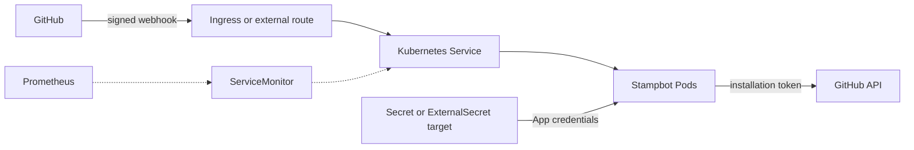

# Stampbot Helm chart

This chart runs Stampbot on Kubernetes. It creates the workload, service,
probes, and policy resources around a GitHub App that you already own.

## What the chart installs

The normal request and credential paths look like this:



GitHub reaches `/webhook` through your external route. Pods read App credentials
from one Kubernetes Secret and call GitHub with installation tokens.
ServiceMonitor is optional; `/metrics` remains on the main service either way.

The chart may also create an Ingress, Horizontal Pod Autoscaler (HPA), Vertical
Pod Autoscaler (VPA), PodDisruptionBudget, NetworkPolicy, Grafana dashboard
ConfigMap, ExternalSecret, and ServiceMonitor.

## Before you install

You need:

- Helm 3.12 or newer;
- a Kubernetes cluster and `kubectl` access to the target namespace;
- a GitHub App configured as described in
  [Install Stampbot](../../INSTALLATION.md#create-the-github-app);
- a public HTTPS route for GitHub webhooks; and
- App ID, private key, and webhook secret values.

The chart doesn't declare a `kubeVersion` range. It uses stable
`apps/v1`, `autoscaling/v2`, `networking.k8s.io/v1`, and `policy/v1` APIs.
Render and validate against the Kubernetes versions you operate.

Optional features need their controllers or custom resource definitions (CRDs)
before `helm install`:

| Feature | Cluster dependency |
| --- | --- |
| `metrics.serviceMonitor.enabled` | Prometheus Operator ServiceMonitor CRD |
| `vpa.enabled` | Vertical Pod Autoscaler CRD and controller |
| `externalSecrets.enabled` | External Secrets Operator |
| `autoscaling.customMetrics.enabled` | A custom metrics API, such as Prometheus Adapter |
| `ingress.enabled` | An ingress controller for the selected class |

Helm doesn't install or upgrade those CRDs.

## Install the chart

Set a chart version you have verified:

```bash
CHART_VERSION=0.13.3
kubectl create namespace stampbot
```

Read the webhook secret without putting its value in shell history:

```bash
read -r -s -p "GitHub webhook secret: " STAMPBOT_WEBHOOK_SECRET
printf '\n'

kubectl create secret generic stampbot-github \
  --namespace stampbot \
  --from-literal=STAMPBOT_APP_ID=123456 \
  --from-file=STAMPBOT_PRIVATE_KEY=./private-key.pem \
  --from-literal=STAMPBOT_WEBHOOK_SECRET="${STAMPBOT_WEBHOOK_SECRET}"

unset STAMPBOT_WEBHOOK_SECRET
```

The Secret must contain those exact three keys.

Create `values.yaml`:

```yaml
github:
  existingSecret: stampbot-github

setup:
  enabled: false
  baseUrl: https://stampbot.example.com

ingress:
  enabled: true
  className: nginx
  hosts:
    - host: stampbot.example.com
      paths:
        - path: /
          pathType: Prefix
  tls:
    - secretName: stampbot-tls
      hosts:
        - stampbot.example.com
```

Inspect the release metadata and defaults:

```bash
helm show chart oci://ghcr.io/dannysauer/charts/stampbot \
  --version "${CHART_VERSION}"
helm show values oci://ghcr.io/dannysauer/charts/stampbot \
  --version "${CHART_VERSION}"
```

Install:

```bash
helm install stampbot oci://ghcr.io/dannysauer/charts/stampbot \
  --version "${CHART_VERSION}" \
  --namespace stampbot \
  --values values.yaml \
  --wait \
  --timeout 5m
```

For a source checkout, replace the OCI URL with `charts/stampbot` and omit
`--version`.

## Verify the release

Wait for Kubernetes and inspect the probes:

```bash
kubectl rollout status deployment/stampbot --namespace stampbot
kubectl get pods --namespace stampbot
kubectl port-forward service/stampbot 8000:80 --namespace stampbot
```

In another terminal:

```bash
curl -fsS http://127.0.0.1:8000/health
curl -fsS http://127.0.0.1:8000/ready
```

Run the chart's post-install tests:

```bash
helm test stampbot --namespace stampbot --logs --timeout 2m
```

`test-connection` checks `/health`, `/ready`, `/metrics`, and `/` from inside
the cluster. `test-webhook` sends a valid signed `ping` and then a tampered one.
It skips the signed test when the release has no configured webhook secret.

The tests prove in-cluster reachability. They don't prove that public DNS, TLS,
or the GitHub App webhook points at this release.

## Upgrade

Read the target release notes and compare its values before changing the
cluster. Keep your values in source control or another managed configuration
store.

Render the candidate with the same values:

```bash
NEXT_CHART_VERSION=0.13.3
helm template stampbot oci://ghcr.io/dannysauer/charts/stampbot \
  --version "${NEXT_CHART_VERSION}" \
  --namespace stampbot \
  --values values.yaml
```

Upgrade and wait:

```bash
helm upgrade stampbot oci://ghcr.io/dannysauer/charts/stampbot \
  --version "${NEXT_CHART_VERSION}" \
  --namespace stampbot \
  --values values.yaml \
  --wait \
  --timeout 5m

kubectl rollout status deployment/stampbot --namespace stampbot
helm test stampbot --namespace stampbot --logs --timeout 2m
```

Avoid `--reuse-values` as your only configuration record. It can carry an old
value into a chart that no longer documents it.

## Roll back

Inspect the release history before choosing a revision:

```bash
helm history stampbot --namespace stampbot
helm rollback stampbot PREVIOUS_REVISION \
  --namespace stampbot \
  --wait \
  --timeout 5m

kubectl rollout status deployment/stampbot --namespace stampbot
helm test stampbot --namespace stampbot --logs --timeout 2m
```

Replace `PREVIOUS_REVISION` with the last healthy revision. Helm can't restore
an external secret, a removed CRD, or a changed GitHub App setting.

## Uninstall

```bash
helm uninstall stampbot --namespace stampbot
```

An existing Secret isn't owned by the release, so Helm leaves it behind. Delete
it only after you confirm that no other workload uses it:

```bash
kubectl delete secret stampbot-github --namespace stampbot
```

## Supply credentials

The Deployment always reads these environment variables from one Secret:

| Secret key | Meaning |
| --- | --- |
| `STAMPBOT_APP_ID` | Numeric GitHub App ID |
| `STAMPBOT_PRIVATE_KEY` | PEM private key content |
| `STAMPBOT_WEBHOOK_SECRET` | GitHub webhook HMAC secret |

Choose one source:

| Mode | Values | Secret owner |
| --- | --- | --- |
| Existing Secret | `github.existingSecret` | You or another controller |
| Inline values | `github.appId`, `github.privateKey`, `github.webhookSecret` | Helm release |
| External Secrets Operator | `externalSecrets.enabled=true` | External Secrets Operator |

Prefer an existing Secret or External Secrets Operator. Inline values may enter
shell history, rendered output, CI logs, and Helm release storage.

### Use External Secrets Operator

The chart creates an `ExternalSecret`, not its `SecretStore` or
`ClusterSecretStore`. Create that store first.

Map the remote secret properties:

```yaml
externalSecrets:
  enabled: true
  secretStore:
    name: aws-secrets-manager
    kind: SecretStore
  refreshInterval: 1h
  data:
    - secretKey: STAMPBOT_APP_ID
      remoteRef:
        key: stampbot/github-credentials
        property: app_id
    - secretKey: STAMPBOT_PRIVATE_KEY
      remoteRef:
        key: stampbot/github-credentials
        property: private_key
    - secretKey: STAMPBOT_WEBHOOK_SECRET
      remoteRef:
        key: stampbot/github-credentials
        property: webhook_secret
```

The generated Secret is named `RELEASE-stampbot-external` unless a name
override changes the chart fullname.

### Use IRSA on Amazon EKS

Use one service-account owner.

If another tool creates the service account, tell Helm to use it:

```yaml
serviceAccount:
  create: false
  name: stampbot

externalSecrets:
  enabled: true
  secretStore:
    name: aws-secrets-manager
    kind: SecretStore
```

If Helm creates the service account, let it add the IAM role annotation:

```yaml
serviceAccount:
  create: true

awsSecretsManager:
  enabled: true
  roleArn: arn:aws:iam::123456789012:role/stampbot-secrets

externalSecrets:
  enabled: true
  secretStore:
    name: aws-secrets-manager
    kind: SecretStore
```

`awsSecretsManager.enabled=true` requires `roleArn` and fails rendering when it
is empty.

The current templates don't read `awsSecretsManager.secretName` or
`awsSecretsManager.region`. Configure remote keys in `externalSecrets.data` and
the AWS region in your SecretStore.

Verify the chain:

```bash
kubectl get serviceaccount stampbot --namespace stampbot -o yaml
kubectl get externalsecret --namespace stampbot
kubectl get secret stampbot-external --namespace stampbot
kubectl rollout status deployment/stampbot --namespace stampbot
```

Adjust the Secret name when the Helm release or fullname differs.

## Validate a local chart

From the repository root:

```bash
helm lint charts/stampbot
helm template stampbot charts/stampbot \
  --set github.existingSecret=stampbot-github
```

The checked-in schema runs during lint, install, and upgrade. Repository CI also
runs kubeconform, Helm unit tests, clean-install cases in kind, chart test hooks,
and upgrades from recent chart lines.

Use `make helm-test` for the repository's full local chart suite. It needs Helm,
Docker, and kubeconform.

## Values reference

`values.schema.json` supplies type and constraint validation.
`values.yaml` remains the source of defaults.

### Image and workload

| Value | Type | Default | Meaning |
| --- | --- | --- | --- |
| `replicaCount` | integer, minimum 1 | `2` | Deployment replicas when HPA is disabled. |
| `image.repository` | string | `ghcr.io/dannysauer/stampbot` | Image repository. |
| `image.pullPolicy` | enum | `IfNotPresent` | `Always`, `IfNotPresent`, or `Never`. |
| `image.tag` | string | empty | Uses chart `appVersion` when empty. |
| `image.digest` | string | empty | Optional `sha256:...` digest. It replaces the tag when set. |
| `imagePullSecrets` | list | `[]` | Image-pull Secret references. |
| `nameOverride` | string | empty | Overrides the chart name portion. |
| `fullnameOverride` | string | empty | Replaces the generated resource fullname. |
| `serviceAccount.create` | boolean | `true` | Creates the workload ServiceAccount. |
| `serviceAccount.annotations` | map | `{}` | ServiceAccount annotations. |
| `serviceAccount.name` | string | empty | Existing or explicit ServiceAccount name. |
| `deploymentAnnotations` | map | `{}` | Deployment metadata annotations. |
| `podAnnotations` | map | Prometheus scrape annotations | Pod-template annotations. |
| `podSecurityContext` | map | non-root UID/GID and RuntimeDefault seccomp | Pod security context. |
| `securityContext` | map | no privilege escalation, all capabilities dropped, read-only root | Container security context. |
| `resources` | map | `100m/128Mi` requests; `500m/512Mi` limits | Container requests and limits. |
| `nodeSelector` | map | `{}` | Pod node selector. |
| `tolerations` | list | `[]` | Pod tolerations. |
| `affinity` | map | preferred hostname anti-affinity | Pod affinity rules. |

### Service and network

| Value | Type | Default | Meaning |
| --- | --- | --- | --- |
| `service.type` | enum | `ClusterIP` | `ClusterIP`, `NodePort`, `LoadBalancer`, or `ExternalName`. |
| `service.port` | integer | `80` | Service port. |
| `service.targetPort` | integer | `8000` | Container target port. |
| `service.annotations` | map | `{}` | Service annotations. |
| `ingress.enabled` | boolean | `false` | Creates an Ingress. |
| `ingress.className` | string | empty | Ingress class. |
| `ingress.annotations` | map | `{}` | Ingress annotations. |
| `ingress.hosts` | list | `stampbot.local` with `/` Prefix | Host and path rules. |
| `ingress.tls` | list | `[]` | Ingress TLS entries. |
| `networkPolicy.enabled` | boolean | `false` | Creates a NetworkPolicy. |
| `networkPolicy.policyTypes` | list | `Ingress` and `Egress` | Policy types. |
| `networkPolicy.ingress` | list | any namespace | Raw ingress rules. Replace the default before relying on isolation. |
| `networkPolicy.egress` | list | namespace, pod, HTTPS, and DNS rules | Raw egress rules. Confirm they fit the cluster CNI and DNS path. |

### App and credentials

| Value | Type | Default | Meaning |
| --- | --- | --- | --- |
| `config.logLevel` | string | `INFO` | `STAMPBOT_LOG_LEVEL`. |
| `config.otelEnabled` | boolean | `false` | `STAMPBOT_OTEL_ENABLED`. |
| `config.otelEndpoint` | string | empty | `STAMPBOT_OTEL_ENDPOINT` when tracing is enabled. |
| `config.otelServiceName` | string | `stampbot` | `STAMPBOT_OTEL_SERVICE_NAME`. |
| `setup.enabled` | boolean | `false` | Enables `/setup`. Keep it off after provisioning. |
| `setup.baseUrl` | string | empty | `STAMPBOT_BASE_URL`. |
| `github.appId` | string or integer | empty | Inline App ID. |
| `github.privateKey` | string | empty | Inline PEM private key. |
| `github.webhookSecret` | string | empty | Inline webhook secret. |
| `github.existingSecret` | string | empty | Existing Secret with all three required keys. |
| `awsSecretsManager.enabled` | boolean | `false` | Adds the configured IRSA role to a Helm-created ServiceAccount. |
| `awsSecretsManager.roleArn` | string | empty | Required IAM role ARN when AWS integration is enabled. |
| `awsSecretsManager.secretName` | string | `stampbot/github-credentials` | Reserved; current templates don't read it. |
| `awsSecretsManager.region` | string | `us-east-1` | Reserved; current templates don't read it. |
| `externalSecrets.enabled` | boolean | `false` | Creates an ExternalSecret. |
| `externalSecrets.secretStore.name` | string | `aws-secrets-manager` | SecretStore name. |
| `externalSecrets.secretStore.kind` | enum | `SecretStore` | `SecretStore` or `ClusterSecretStore`. |
| `externalSecrets.refreshInterval` | string | `1h` | ExternalSecret refresh interval. |
| `externalSecrets.data` | list | three credential mappings | Target Secret keys and remote references. |
| `opentelemetry.enabled` | boolean | `false` | Reserved; use `config.otelEnabled`. |
| `opentelemetry.endpoint` | string | `http://otel-collector:4317` | Reserved; use `config.otelEndpoint`. |
| `opentelemetry.serviceName` | string | `stampbot` | Reserved; use `config.otelServiceName`. |

### Scaling and observability

| Value | Type | Default | Meaning |
| --- | --- | --- | --- |
| `metrics.enabled` | boolean | `true` | Gates ServiceMonitor creation. It doesn't disable `/metrics`. |
| `metrics.serviceMonitor.enabled` | boolean | `false` | Creates a ServiceMonitor when `metrics.enabled` is also true. |
| `metrics.serviceMonitor.interval` | string | `30s` | Prometheus scrape interval. |
| `metrics.serviceMonitor.scrapeTimeout` | string | `10s` | Prometheus scrape timeout. |
| `autoscaling.enabled` | boolean | `true` | Creates an HPA and ignores `replicaCount`. |
| `autoscaling.minReplicas` | integer | `2` | HPA minimum replicas. |
| `autoscaling.maxReplicas` | integer | `10` | HPA maximum replicas. |
| `autoscaling.targetCPUUtilizationPercentage` | integer or null | `80` | CPU target. Set null to omit CPU metrics. |
| `autoscaling.customMetrics.enabled` | boolean | `false` | Adds the raw custom metric list to the HPA. |
| `autoscaling.customMetrics.metrics` | list | request-count example | Raw `autoscaling/v2` metric specifications. |
| `vpa.enabled` | boolean | `false` | Creates a VPA. |
| `vpa.updateMode` | enum | `Auto` | `Off`, `Initial`, `Recreate`, or `Auto`. |
| `vpa.minAllowed` | map | `50m` CPU, `64Mi` memory | Minimum recommendation. |
| `vpa.maxAllowed` | map | `1000m` CPU, `1Gi` memory | Maximum recommendation. |
| `podDisruptionBudget.enabled` | boolean | `true` | Creates a PodDisruptionBudget. |
| `podDisruptionBudget.minAvailable` | integer or string | `1` | Minimum available Pods. |
| `grafanaDashboard.enabled` | boolean | `false` | Creates the bundled dashboard ConfigMap. |
| `grafanaDashboard.labels` | map | `grafana_dashboard: "1"` | Dashboard discovery labels. |
| `grafanaDashboard.annotations` | map | `{}` | Dashboard ConfigMap annotations. |

## Security notes

- Prefer `github.existingSecret` or External Secrets Operator.
- Keep `setup.enabled=false` after setup.
- Pin a verified chart version and image digest for controlled promotion.
- Protect `/metrics` at the network boundary when it shouldn't be public.
- Review the default NetworkPolicy rules before enabling them; defaults are
  examples, not a cluster-specific least-privilege policy.
- The default container runs as UID 1000, drops every Linux capability, blocks
  privilege escalation, uses RuntimeDefault seccomp, and mounts a writable
  `/tmp` while keeping the root filesystem read-only.

See [Verify a Stampbot release](../../docs/release-verification.md) before
promoting a new chart or image.
