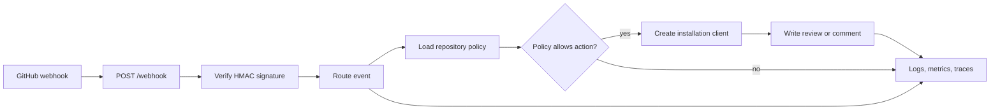
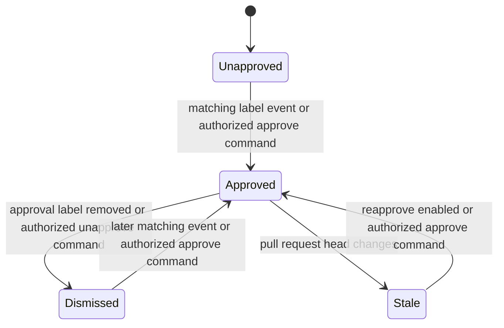

# Architecture

Stampbot sits between GitHub webhooks and GitHub's pull request review API. It
has no database and owns no merge state.

Think of it as another reviewer at the table. It can raise its hand, withdraw
that hand, and explain why. It can't press the Merge button.

## From webhook to review

This diagram shows the main request path and the point where repository policy
enters it.

GitHub signs the raw body with the App's webhook secret. The HTTP layer rejects
an invalid signature before it parses or routes the event. Valid requests then
move to `WebhookHandler`.

The handler loads policy for the target repository and decides whether the
event calls for an approval, dismissal, help comment, or no action. When it
needs GitHub, `GitHubAppClient` exchanges an App JWT for an installation token.
That token carries the installation's repository scope.

The response to GitHub only says what Stampbot did with the event. The visible
result lives on the pull request timeline.

## Approval lifecycle

Stampbot tracks its state through GitHub reviews rather than local storage.
This keeps replicas independent, but it also makes GitHub the final source of
truth.

In plain text:

- A matching `opened`, `reopened`, or `labeled` event can create approval.
- Eligibility filters apply to label-driven approval.
- Removing any configured approval label dismisses active Stampbot approvals.
- A new head commit leaves the old review behind. `reapprove` decides whether a
  `synchronize` event can add a fresh one.
- An authorized ChatOps command can approve the current head or dismiss active
  Stampbot reviews.

The diagram describes Stampbot's reviews. GitHub may apply separate branch
rules, dismissal settings, and merge requirements.

## Where policy comes from

For each webhook, Stampbot looks in this order:

1. `stampbot.toml` on the target repository's default branch;
2. `stampbot.toml` in the owner's `.github` repository, when the target belongs
   to an organization; and
3. the defaults loaded by the running Stampbot service.

There are two different failure paths. If GitHub can't return a policy file,
Stampbot logs the read failure and uses its defaults. If it reads a file but
can't parse or validate it, Stampbot stops automation for that event. On a new
pull request, it also leaves a review comment with the validation error.

That difference is deliberate in the current implementation. Operators who
need a stricter fallback should set conservative service defaults and monitor
`stampbot_repo_config_loads_total`.

## Components and ownership

| Component | Responsibility |
| --- | --- |
| `stampbot/main.py` | FastAPI routes, body limits, signature entry point, setup pages, and HTTP telemetry |
| `stampbot/webhook_handler.py` | Event routing, policy decisions, ChatOps parsing, and approval lifecycle |
| `stampbot/github_client.py` | App authentication, installation clients, retries, and GitHub API calls |
| `stampbot/config.py` | Service settings, repository defaults, TOML parsing, and policy validation |
| `stampbot/metrics.py` | Prometheus metric definitions |
| `stampbot/telemetry.py` | Optional OpenTelemetry export and span helpers |
| `charts/stampbot/` | Kubernetes packaging and runtime policy |

The [interface reference](reference.md) describes the public surface. The
[configuration reference](configuration.md) describes the values that feed
these components.

## Trust boundaries

The webhook body is untrusted until HMAC-SHA256 verification succeeds.
Stampbot compares signatures in constant time and caps the body at 1 MiB. A
valid signature proves GitHub sent the payload, not that repository contributors
are trusted: pull request titles remain attacker-controlled. Title matching
bounds inputs and execution time and runs outside the asyncio event loop.

Repository policy is trusted at the same level as the target repository's
default branch. Anyone who can change that file can change when Stampbot
approves in that repository.

The App private key and webhook secret cross a more sensitive boundary. They
belong in a secret store, never in `stampbot.toml` or source control.
Installation tokens are short-lived and scoped by GitHub, but they still need
the least permissions listed in the [configuration reference](configuration.md#github-app-permissions).

`/setup` returns generated credentials during the manifest flow. It is disabled
by default, uses only the configured trusted base URL, and closes automatically
after credentials are present. Reopening it requires a second explicit flag.
`/metrics` has no application-level authentication, so protect it at the
ingress or service boundary when the service is public.

## Deliberate boundaries

Stampbot creates and dismisses only reviews made by its own App identity. It
doesn't merge, edit branch protection, grant repository access, or pretend to
be a native `CODEOWNERS` entry.

Those limits keep the approval decision visible. They also leave final control
with GitHub's branch rules and the people who own the repository.
