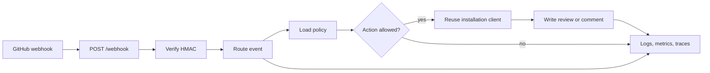
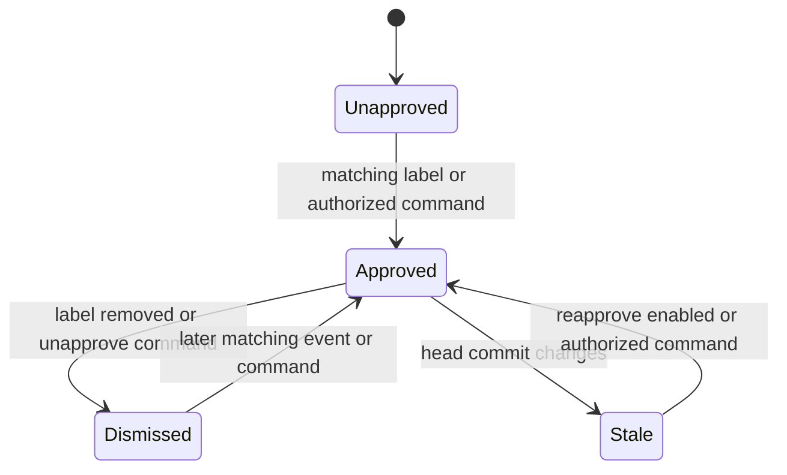

# Architecture

Stampbot sits between GitHub's webhook service and pull request review API. It
keeps no database and owns no merge state.

Think of it as a reviewer with one job. It may raise its hand, withdraw that
hand, and explain a configuration error. The Merge button remains across the
table. That's as far as the metaphor goes.

## Request path

GitHub signs the raw request body with the App's webhook secret. The HTTP layer
checks that signature before parsing JSON or routing the event. It also rejects
bodies larger than 1 MiB.

A valid request moves to `WebhookHandler`. The handler loads policy for the
target repository and decides whether the event calls for approval, dismissal,
a help comment, or no action.

When a write is needed, `GitHubAppClient` builds a client for that operation
on credentials shared per installation. The first operation signs an App JWT and
exchanges it for an installation token; later operations reuse that token until
shortly before GitHub expires it. GitHub scopes the token to the installation.
The visible result lands on the pull request timeline; the webhook response only
describes what Stampbot did.

Pull request actions that cannot change review state, such as `edited`,
`closed`, and `review_requested`, return before any policy read or GitHub
request.

## Review state

Stampbot finds its state in GitHub reviews instead of local storage. Replicas
therefore agree without coordination, and GitHub remains authoritative.

The same flow in words:

- `opened`, `reopened`, and `labeled` may create a label-driven approval.
  GitHub sends both `opened` and `labeled` for a pull request created with a
  label, so two replicas can approve at once. Stampbot accepts that and
  dismisses every approval of the head except the oldest afterwards, rather
  than letting one event defer to another and risk a missed approval when the
  other never arrives.
- Every configured eligibility category must pass before that approval.
- Removing any configured approval label dismisses active Stampbot approvals.
- A new head makes an old approval stale. `reapprove` decides whether a
  `synchronize` event may create a fresh review.
- An authorized ChatOps command may approve the current head or dismiss active
  Stampbot reviews.

This is only Stampbot's state machine. GitHub applies branch rules, dismissal
settings, and merge requirements after it.

## Policy boundary

For every event, Stampbot looks for policy in this order:

1. `stampbot.toml` on the target repository's default branch;
2. `stampbot.toml` in the owner's `.github` repository, for organization-owned
   repositories; and
3. defaults from the running service.

The first file wins. Repository and organization files are not merged. A
missing file moves lookup to the next source.

Each replica caches valid results, including "no file found", per installation,
repository, and default branch for `STAMPBOT_REPO_CONFIG_CACHE_SECONDS`
(default 300). Invalid policy and read failures bypass the cache, so the
fail-closed paths below always re-read GitHub.

The organization repository is optional. GitHub returns a repository-level
`404` when `OWNER/.github` doesn't exist or the App installation doesn't include
it; Stampbot continues to service defaults in either case. A failure reading
the target repository's policy stops automation for that event. Once GitHub
makes the organization repository available to the App, a failure reading its
policy does too. A readable but invalid file also stops automation. Operators
should alert on `stampbot_repo_config_loads_total{status="error"}`.

Repository title patterns cross a smaller boundary inside this flow. A
maintainer supplies the expression, while any pull request author may supply
the title. Stampbot bounds pattern count and length, caps title length, applies
a per-pattern timeout, and runs matching outside the event loop. A timeout
fails closed.

## Components

| Component | Owns |
| --- | --- |
| `stampbot/main.py` | HTTP routes, body limits, setup gates, and request metrics |
| `stampbot/webhook_handler.py` | Event routing, policy decisions, ChatOps, and review lifecycle |
| `stampbot/repo_policy.py` | Policy lookup order and the per-replica policy cache |
| `stampbot/github_client.py` | App authentication, installation clients, retries, and GitHub calls |
| `stampbot/config.py` | Service settings, repository defaults, TOML parsing, and policy validation |
| `stampbot/manifest.py` | Trusted setup URLs and GitHub App manifest creation |
| `stampbot/metrics.py` | Prometheus metric definitions and the dedicated listener lifecycle |
| `stampbot/telemetry.py` | Optional OpenTelemetry export and span helpers |
| `stampbot/version.py` | One runtime version shared by HTTP, metrics, and traces |
| `charts/stampbot/` | Kubernetes packaging and deployment policy |

The [interface reference](reference.md) describes the surfaces these components
expose. The [configuration reference](configuration.md) describes their inputs.

## Trust boundaries

Stampbot rejects a webhook body unless its HMAC-SHA256 signature passes a
constant-time comparison. A match proves that the sender knew the webhook
secret and that the body has not changed since signing. When only GitHub and
Stampbot's operators and runtime hold that secret, Stampbot treats the request
as a GitHub delivery. The payload remains untrusted data.

Repository policy has the trust level of the default branch that holds it.
Anyone who can change that file can change when Stampbot approves in that
repository.

The App private key and webhook secret are credentials. They belong in a secret
store, never in repository policy, logs, examples, or issue reports.
Installation tokens are short-lived and installation-scoped, but they still
carry the App permissions listed in the
[configuration reference](configuration.md#github-app-permissions).

`/setup` returns generated credentials during the manifest flow. It is disabled
by default, uses only the configured trusted base URL, and closes automatically
after credentials are present. Reopening it requires a second explicit flag.
Metrics use a disabled-by-default listener on a separate port. That listener
has no application-level authentication, so bind it only to loopback or a
private monitoring network. The public HTTP listener never serves `/metrics`.

Endpoint labels use route templates, and unmatched paths collapse to one value.
Raw attacker-controlled paths never become labels.

## Deliberate limits

Stampbot creates and dismisses reviews made by its own App identity. It doesn't
merge, edit branch protection, grant repository access, or impersonate a native
`CODEOWNERS` entry.

Those limits keep its decision visible and leave final control with GitHub's
rules and the people who own the repository.
