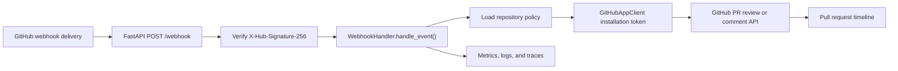
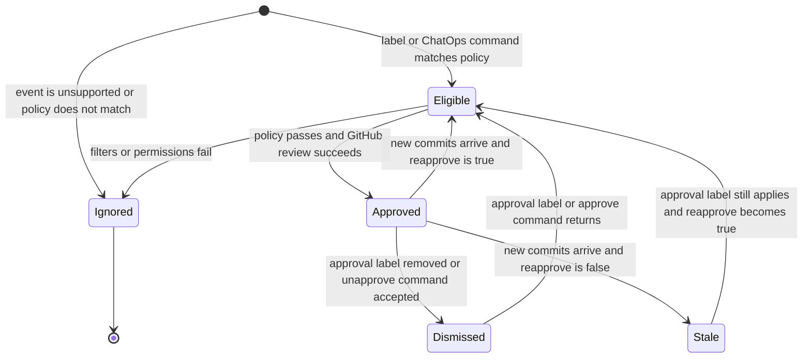

# Architecture

Stampbot is a GitHub App implemented with FastAPI. It receives GitHub webhook events,
evaluates repository policy, and creates or dismisses only Stampbot's own pull request
reviews.

## Request Flow

The following diagram shows the normal webhook path from GitHub to Stampbot's
GitHub API writes:

In text form, GitHub sends a signed webhook to `/webhook`; Stampbot verifies the
signature, routes the event, loads repository policy, authenticates as the GitHub
App installation, writes only its own review/comment outputs, and emits
operational telemetry.

The webhook handler supports:

- `ping` events for GitHub App health checks
- `pull_request` events for label-driven approval and dismissal
- `issue_comment` events for ChatOps commands such as `@stampbot stamp`

## Approval State Model

The following state diagram summarizes how Stampbot treats a pull request across
label, ChatOps, and new-commit events:

In text form, Stampbot ignores unsupported events, approves only when policy and
permissions pass, dismisses only its own approval when policy no longer applies,
and reapproves after new commits only when repository configuration opts in.

## Main Components

- `stampbot/main.py`: FastAPI application, HTTP endpoints, webhook signature entry point
- `stampbot/webhook_handler.py`: event routing, label policy, ChatOps handling
- `stampbot/github_client.py`: GitHub App JWT creation, installation tokens, API calls
- `stampbot/config.py`: application and repository configuration loading
- `stampbot/metrics.py`: Prometheus metrics
- `stampbot/telemetry.py`: OpenTelemetry setup
- `charts/stampbot/`: Kubernetes deployment chart

See [reference.md](reference.md) for public HTTP routes and
[configuration.md](configuration.md) for settings, permissions, and repository policy.

## Configuration Model

Application configuration comes from environment variables and local configuration files.
Repository approval policy comes from `stampbot.toml` in the target repository, or from an
organization `.github` repository fallback.

Environment variables have the highest application configuration precedence. Repository
policy is evaluated per webhook event so different repositories can use different labels,
commands, permission thresholds, and eligibility filters.

## Trust Boundaries

Stampbot treats GitHub webhook payloads as untrusted until the HMAC-SHA256 signature has
been verified with the configured webhook secret.

Stampbot authenticates to GitHub as a GitHub App by signing a short-lived JWT with the
configured private key and exchanging that JWT for installation access tokens. Installation
tokens are scoped by GitHub to the repositories where the app is installed.

Repository configuration is read from the repository being acted on. Contributors who can
change a repository's default branch configuration can affect that repository's Stampbot
policy.

## External Outputs

Stampbot can create pull request approval reviews, dismiss its own reviews, post ChatOps
help comments, expose health responses, expose Prometheus metrics, and emit structured
logs/traces. Stampbot does not merge pull requests.

Operational triage for these outputs is in [operations.md](operations.md).
